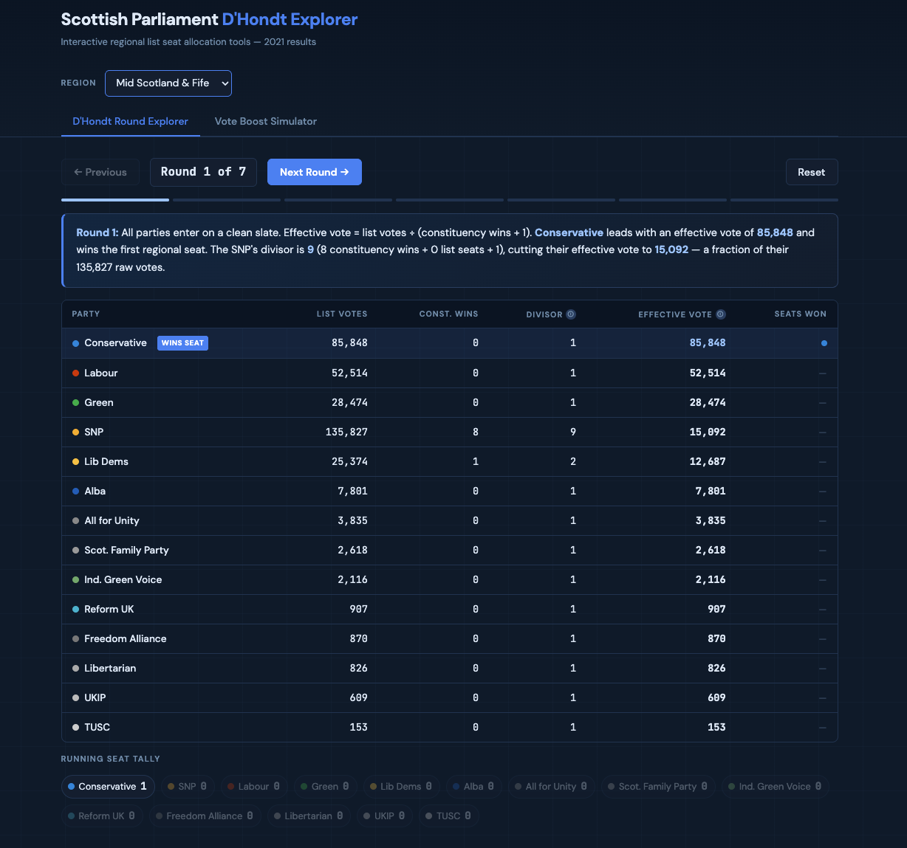

# Scottish Parliament D'Hondt Explorer

An interactive single-page web app for understanding how regional list seats are allocated in Scottish Parliament elections using the D'Hondt method.

Built in vanilla HTML/CSS/JS — open `holyrood-2021.html` directly in a browser, no build step required.

 

---

## What it does

The Scottish Parliament uses the Additional Member System. Voters cast two ballots: one for a constituency MSP (first-past-the-post) and one for a regional party list. The D'Hondt method allocates the 7 regional list seats per region — and it actively corrects for constituency dominance by penalising parties that already hold many constituency seats.

This app has two tools:

### Tab 1 — D'Hondt Round Explorer

Steps through all 7 allocation rounds for any region. Shows:

- **Narration** — plain-English explanation of who won each round and why
- **Round-by-round table** — party list votes, constituency wins, current divisor, effective vote (votes ÷ divisor), and seats won so far
- **Winner highlighting** and de-emphasis of non-competitive parties
- **Running seat tally** as coloured chips
- **Cost per seat** on the final round — raw list votes divided by seats won, making the SNP's structural list inefficiency visible



### Tab 2 — Vote Boost Simulator

Answers "what if a party had more list votes?" in real time:

- **Party selector** — boost any party, not just the SNP
- **Boost slider** — 0 to 200,000 extra votes in 1,000-vote steps
- **Vote source** — new voters (thin air), from Labour, from Conservative, from Labour & Conservative equally, or from all unionist parties equally
- **Turnout impact panel** — when using "thin air", shows the implied turnout % and contextualises it against historical Scottish Parliament turnout
- **Before/after comparison** — actual vs. simulated seats with gain/loss badges
- **Displacement detection** — flags when boosting an independence party gains a seat but displaces another independence party (net gain: zero)
- **Key insight box** — dynamically generated plain-English conclusion
- **Full simulated D'Hondt table** — effective votes for every party in every round

---

## Usage

```
open index.html
```

No server, no build step, no npm. Just open the file.

---

## Updating for 2026 results

All regional data lives in a single `REGIONS` object near the top of `index.html`, clearly marked:

```js
// ╔══════════════════════════════════════════════════════════╗
// ║  UPDATE WITH 2026 DATA HERE                              ║
// ╚══════════════════════════════════════════════════════════╝
```

Each region follows this structure:

```js
"Mid Scotland & Fife": {
  year: 2021,
  approximate: false,      // set true if figures are estimates
  electorate: 516000,      // registered electorate (for turnout %)
  totalVotes: 344059,
  seats: 7,
  parties: [
    { name: "SNP", votes: 135827, cWins: 8, color: "#faa61a" },
    // ...
  ]
}
```

Replace `votes`, `cWins`, `electorate`, `totalVotes`, and `year` with official 2026 figures. Set `approximate: false` once verified. Everything else — all tables, narration, charts, and simulator outputs — recalculates automatically.

---

## Data sources

| Region | Status |
|--------|--------|
| Mid Scotland & Fife | Official 2021 figures — Electoral Management Board for Scotland |
| All other regions | Approximate — derived from national percentage shares and regional vote totals. Clearly labelled in the UI. |

Official 2021 results: [Scottish Parliament election results](https://www.parliament.scot/msps/elections/2021-scottish-parliament-election)

---

## Technical notes

- **Algorithm**: Pure D'Hondt. Each round awards a seat to the party with the highest `votes ÷ (constituency wins + list seats won + 1)`. Ties broken by raw vote total.
- **Dependencies**: Google Fonts only (DM Sans + JetBrains Mono). All logic is vanilla JS.
- **Performance**: All D'Hondt calculations run synchronously in the browser as the slider moves. With 7 rounds and up to 14 parties per region, this is ~100 operations — imperceptibly fast.
- **Responsive**: Works on mobile. Tables scroll horizontally on small screens.
